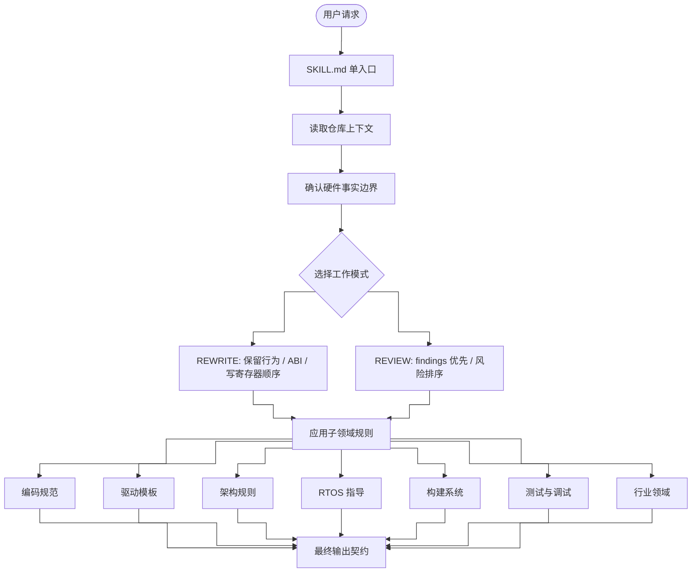

# embedded-code-skill

<p align="center">
  
  
  
  
  
  
  
</p>

> 嵌入式 C 代码助手，用于写驱动骨架、整理旧代码、审查低层固件、指导 RTOS 使用和构建系统配置。

[简体中文](README.md) · [English](README_EN.md) · [日本語](README_JP.md)

---

## 这个仓库是什么

这个仓库只有一个规则入口：`SKILL.md`。

`SKILL.md` 帮助模型在下面这些任务中保持稳定、保守、可审查的输出：

- 写新的嵌入式 C 驱动骨架（含函数级模板）
- 整理旧的驱动、HAL/BSP 或寄存器访问代码
- 审查 ISR、DMA、cache、volatile、竞态、timeout、overflow 等低层风险
- 指导 RTOS 任务设计、线程安全、优先级反转防护
- 指导构建系统配置（CMake 交叉编译、链接脚本、startup 代码）
- 指导 HAL 层测试和 on-target 调试策略
- 仓库代码符合本 skill 规范则沿用，不符合则在不改变逻辑的前提下统一

它**不是**芯片厂商参考手册，也不会替代真实寄存器表、IRQ、屏障、cache/DMA 规则、时序要求或认证资料。

---

## 快速开始

```bash
/ecs 生成一个 STM32 UART 驱动，基地址 0x4000C000
/ecs 整理这段 SPI 初始化代码，并保留寄存器写入顺序
/ecs 审查这段 DMA ISR 是否有竞态、volatile 或 cache 问题
/ecs 设计 FreeRTOS 任务优先级和栈大小
/ecs 帮我写 CMake 交叉编译配置和链接脚本
```

---

## 工作模式

| 模式 | 用途 |
|------|------|
| `REWRITE` | 整理旧代码，保留外部行为、ABI、寄存器写入顺序和时序敏感序列 |
| `REVIEW` | finding 优先，先看 correctness、硬件行为、竞态和可移植风险 |

---

## Skill 架构

`SKILL.md` 是单入口文件，共 12 章，按"请求识别 → 仓库上下文 → 工作模式 → 子领域规则 → 输出契约"的顺序组织。



---

## 功能矩阵

| 章节 | 层级 | 覆盖内容 |
|------|------|----------|
| Ch.1 | 定位与使用原则 | 任务分类、仓库上下文读取、硬件事实边界、输出契约 |
| Ch.2 | Fallback 编码规范 | 命名、类型、错误处理、结构体模式、注释（已去重合并） |
| Ch.3 | 寄存器抽象 | 独立寄存器定义、MASK/SHIFT 宏、vendor/CMSIS 复用 |
| Ch.4 | 驱动模板 | UART、SPI、I2C、DMA、CAN、GPIO、Timer、Watchdog、MIL-STD-1553（含函数级骨架） |
| Ch.5 | 架构规则 | Cortex-M、Cortex-A、ESP32/Xtensa、RP2040、NRF52、RISC-V、PowerPC、SPARC V8 |
| Ch.6 | RTOS 指导 | FreeRTOS、Zephyr、RT-Thread：任务设计、线程安全、ISR 交互、优先级反转、死锁预防 |
| Ch.7 | 构建系统 | CMake 交叉编译、链接脚本 section、startup 代码、编译器 attribute |
| Ch.8 | 测试与调试 | HAL mock 模式、断言分级、on-target 调试约定 |
| Ch.9 | 行业领域 | 航空、军工、工业安全、汽车功能安全、General Embedded |
| Ch.10 | 内存与并发 | 动态分配限制、VLA 禁令、critical section、memory ordering |
| Ch.11 | 反例集 | 5 组典型反例（寄存器散落、cache coherency、ISR 阻塞、volatile 漏用、优先级反转） |
| Ch.12 | 回查清单与维护自检 | 硬件常量来源、并发安全、RTOS 安全、smoke check 场景 |

---

## 核心规则

| 类别 | 规则 |
|------|------|
| 规范统一 | 仓库代码若符合本 skill 规范则沿用，不符合则在不改变逻辑的前提下修改 |
| 硬件事实 | 不编造寄存器偏移、位定义、reset 值、IRQ、屏障或时序要求 |
| 输出契约 | 重写、审查分别有固定输出顺序 |
| 类型 | 公共接口优先使用固定宽度整数和 `bool` |
| 错误处理 | 项目无约定时使用 `embedded_code_status_t` |
| 寄存器抽象 | 使用独立寄存器定义或复用 vendor/CMSIS 结构 |
| 内存 | 低层驱动默认不使用动态分配或 VLA |
| 并发安全 | ISR、DMA、cache、critical section 和 memory ordering 必须保守处理 |
| RTOS 安全 | ISR 中禁止阻塞，使用 FromISR API；共享数据必须有同步保护 |

---

## 子领域覆盖

`SKILL.md` 里内置以下子领域规则（共 12 章），不再拆成单独目录。

### 编码规范（Ch.2）

- 命名、指针命名、固定宽度类型、`bool`
- fallback status type：`embedded_code_status_t`（含 `VALIDATE_NOT_NULL` 和 `VALIDATE_INIT`）
- 配置结构体、运行时句柄、状态枚举的组织方式
- magic number、buffer size、timeout、retry count、注释和 review checklist

### 寄存器抽象（Ch.3）

- 每个外设 block 一个独立 `*_reg.h`
- 统一入口访问寄存器（`*_REG`），位字段使用 `MASK/SHIFT` 宏
- 不把裸寄存器地址散落在业务逻辑中

### 驱动模板（Ch.4）

- 统一结构：`*_reg.h`、`*_reg_t`、`*_REG`、`MASK/SHIFT`
- **函数级骨架**：UART/SPI/GPIO/DMA 初始化、收发、ISR handler 完整模式
- 覆盖 UART、SPI、I2C、DMA、CAN、GPIO、Timer、Watchdog、MIL-STD-1553
- 模板只说明组织方式，真实 offset、reserved bit、reset 值和 errata 必须来自目标资料

### 架构规则（Ch.5）

- 覆盖 ISR、barrier、DMA、cache、interrupt controller、SMP、memory ordering、CSR/SPR
- 包含 Cortex-M、Cortex-A、**ESP32/Xtensa**、**RP2040 双核**、**NRF52**、RISC-V、PowerPC、SPARC V8 quick ref
- ESP32 特有模式：`IRAM_ATTR`、`FromISR` API、双核分工、SPI 高层 API
- RP2040 特有模式：Pico SDK、双核 FIFO、DMA 通道分配
- NRF52 特有模式：nrfx 驱动层、GPIOTE 回调、SoftDevice 优先级
- 未知架构时要求资料来源；不能确认时只生成架构无关骨架并标注 placeholder

### RTOS 指导（Ch.6）

- FreeRTOS、Zephyr、RT-Thread API 对照表
- 任务设计：栈大小、优先级、创建顺序、看门狗
- 线程安全数据共享：互斥量、队列、原子操作
- ISR 与 RTOS 交互：禁止阻塞、使用 FromISR API、短且快
- 优先级反转防护：优先级继承互斥量
- 死锁预防：固定锁顺序、超时等待

### 构建系统（Ch.7）

- 链接脚本：`.text`、`.rodata`、`.data` 搬运、`.bss` 清零
- Startup 代码：data 搬运、bss 清零、SystemInit、main 调用顺序
- 编译器 attribute：`interrupt`、`section`、`aligned`、`weak`、`always_inline`
- CMake 交叉编译模板

### 测试与调试（Ch.8）

- HAL mock 模式：函数指针表实现可替换 HAL
- 断言分级：`STATIC_ASSERT`、`ASSERT`、`SOFT_ASSERT`
- On-target 调试：调试引脚、错误码追踪、栈溢出检测、看门狗、日志级别

### 行业领域（Ch.9）

- 覆盖 Aerospace / DO-178C、Military / MIL-STD、Industrial / IEC 61508、Automotive / ISO 26262、General Embedded
- 各领域有默认要求（如无动态分配、safe state、接口隔离等），但 DAL/ASIL/SIL 等级不作为通用默认值

---

## 包结构

```text
embedded-code-skill/
├── SKILL.md       # 唯一规则入口
├── install.sh     # 安装脚本
├── LICENSE        # MIT 许可证
├── README.md      # 中文说明
├── README_EN.md   # 英文说明
└── README_JP.md   # 日文说明
```

---

## 许可

MIT License
