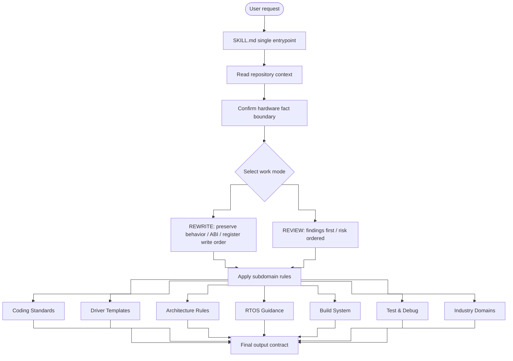

# embedded-code-skill

<p align="center">
  
  
  
  
  
  
  
</p>

> Embedded C code assistant for driver skeletons, legacy-code cleanup, low-level firmware review, RTOS guidance, and build system configuration.

[简体中文](README.md) · [English](README_EN.md) · [日本語](README_JP.md)

---

## What This Repository Is

This repository has one rule entrypoint: `SKILL.md`.

`SKILL.md` helps the model produce stable, conservative, reviewable output when:

- writing new Embedded C driver skeletons (with function-level templates)
- cleaning up legacy driver, HAL/BSP, or register-access code
- reviewing ISR, DMA, cache, volatile, race, timeout, and overflow risks
- guiding RTOS task design, thread safety, and priority inversion prevention
- guiding build system configuration (CMake cross-compilation, linker scripts, startup code)
- guiding HAL-layer testing and on-target debugging strategies
- aligning repo code with skill rules: reuse if conformant, adapt without logic changes if not

It is **not** a substitute for a vendor reference manual, real register map, IRQ table, barrier rule, cache/DMA rule, timing requirement, or certification artifact.

---

## Quick Start

```bash
/ecs Generate an STM32 UART driver skeleton, base address 0x4000C000
/ecs Clean up this SPI init code, preserving register write sequence
/ecs Review this DMA ISR for race, volatile, or cache issues
/ecs Design FreeRTOS task priorities and stack sizes
/ecs Help me write CMake cross-compilation config and linker script
```

---

## Work Modes

| Mode | Purpose |
|------|---------|
| `REWRITE` | Clean up code while preserving public behavior, ABI, register write order, and timing-sensitive sequences |
| `REVIEW` | Lead with findings; prioritize correctness, hardware behavior, races, and portability risk |

---

## Skill Architecture

`SKILL.md` is the single entrypoint with 12 chapters, organized as request classification, repository context, work mode, subdomain rules, and output contract.



---

## Capability Matrix

| Chapter | Layer | Coverage |
|---------|-------|----------|
| Ch.1 | Positioning & Principles | Task classification, repo context, hardware fact boundary, output contract |
| Ch.2 | Fallback Coding Standards | Naming, types, error handling, struct patterns, comments (deduplicated) |
| Ch.3 | Register Abstraction | Dedicated register defs, MASK/SHIFT macros, vendor/CMSIS reuse |
| Ch.4 | Driver Templates | UART, SPI, I2C, DMA, CAN, GPIO, Timer, Watchdog, MIL-STD-1553 (with function-level skeletons) |
| Ch.5 | Architecture Rules | Cortex-M, Cortex-A, ESP32/Xtensa, RP2040, NRF52, RISC-V, PowerPC, SPARC V8 |
| Ch.6 | RTOS Guidance | FreeRTOS, Zephyr, RT-Thread: task design, thread safety, ISR interaction, priority inversion, deadlock prevention |
| Ch.7 | Build System | CMake cross-compilation, linker script sections, startup code, compiler attributes |
| Ch.8 | Test & Debug | HAL mock pattern, assertion levels, on-target debugging conventions |
| Ch.9 | Industry Domains | Aerospace, military, industrial safety, automotive functional safety, general embedded |
| Ch.10 | Memory & Concurrency | Dynamic allocation limits, VLA ban, critical sections, memory ordering |
| Ch.11 | Anti-patterns | 5 typical anti-patterns (scattered registers, cache coherency, ISR blocking, volatile misuse, priority inversion) |
| Ch.12 | Review Checklist & Maintenance | Hardware sources, concurrency, RTOS safety, smoke check scenarios |

---

## Core Rules

| Category | Rule |
|----------|------|
| Rule alignment | Reuse repo code if it conforms to skill rules; otherwise adapt to skill rules without changing logic |
| Hardware facts | Do not invent register offsets, bit fields, reset values, IRQs, barriers, or timing requirements |
| Output contract | Rewrite and review modes each have a fixed response shape |
| Types | Prefer fixed-width integers and `bool` in public interfaces |
| Error handling | Use `embedded_code_status_t` only when the project has no local convention |
| Register access | Use dedicated register definitions or existing vendor/CMSIS structs |
| Memory | Avoid dynamic allocation and VLAs in low-level drivers by default |
| Concurrency | Treat ISR, DMA, cache, critical sections, and memory ordering conservatively |
| RTOS safety | Never block in ISR; use FromISR APIs; protect shared data with synchronization primitives |

---

## Subdomain Coverage

`SKILL.md` includes these subdomain rule sets directly (12 chapters total). They are no longer split into separate directories.

### Coding Standards (Ch.2)

- Naming, pointer naming, fixed-width types, and `bool`
- Fallback status type: `embedded_code_status_t` (with `VALIDATE_NOT_NULL` and `VALIDATE_INIT`)
- Config structs, runtime handles, and state enums
- Magic numbers, buffer sizes, timeouts, retry counts, comments, and review checklist

### Register Abstraction (Ch.3)

- One dedicated `*_reg.h` per peripheral block
- Unified register access via `*_REG`, bit fields use `MASK/SHIFT` macros
- No scattered bare register addresses in business logic

### Driver Templates (Ch.4)

- Common structure: `*_reg.h`, `*_reg_t`, `*_REG`, `MASK/SHIFT`
- **Function-level skeletons**: Full patterns for UART/SPI/GPIO/DMA init, transfer, and ISR handler
- Covers UART, SPI, I2C, DMA, CAN, GPIO, Timer, Watchdog, and MIL-STD-1553
- Treats templates as organization examples only; real offsets, reserved bits, reset values, and errata must come from target sources

### Architecture Rules (Ch.5)

- Covers ISRs, barriers, DMA, cache, interrupt controllers, SMP, memory ordering, and CSR/SPR access
- Includes Cortex-M, Cortex-A, **ESP32/Xtensa**, **RP2040 dual-core**, **NRF52**, RISC-V, PowerPC, and SPARC V8 quick refs
- ESP32-specific patterns: `IRAM_ATTR`, `FromISR` APIs, dual-core workload split, high-level SPI API
- RP2040-specific patterns: Pico SDK, dual-core FIFO, DMA channel allocation
- NRF52-specific patterns: nrfx driver layer, GPIOTE callbacks, SoftDevice priority
- For unknown architectures, require source material; otherwise generate architecture-neutral skeletons with placeholders

### RTOS Guidance (Ch.6)

- FreeRTOS, Zephyr, and RT-Thread API comparison table
- Task design: stack size, priority, creation order, watchdog
- Thread-safe data sharing: mutexes, queues, atomics
- ISR-to-RTOS interaction: never block, use FromISR APIs, keep short
- Priority inversion prevention: priority-inheritance mutexes
- Deadlock prevention: fixed lock ordering, timeout waits

### Build System (Ch.7)

- Linker scripts: `.text`, `.rodata`, `.data` relocation, `.bss` zeroing
- Startup code: data copy, bss clear, SystemInit, main call order
- Compiler attributes: `interrupt`, `section`, `aligned`, `weak`, `always_inline`
- CMake cross-compilation template

### Test & Debug (Ch.8)

- HAL mock pattern: function-pointer table for swappable HAL
- Assertion levels: `STATIC_ASSERT`, `ASSERT`, `SOFT_ASSERT`
- On-target debugging: debug pin, error code tracing, stack overflow detection, watchdog, log levels

### Industry Domains (Ch.9)

- Covers Aerospace / DO-178C, Military / MIL-STD, Industrial / IEC 61508, Automotive / ISO 26262, General Embedded
- Each domain has default requirements (e.g., no dynamic allocation, safe state, interface isolation), but DAL/ASIL/SIL ratings are not treated as universal defaults

---

## Package Layout

```text
embedded-code-skill/
├── SKILL.md       # Single rule entrypoint
├── install.sh     # Install script
├── LICENSE        # MIT License
├── README.md      # Chinese readme
├── README_EN.md   # English readme
└── README_JP.md   # Japanese readme
```

---

## License

MIT License
