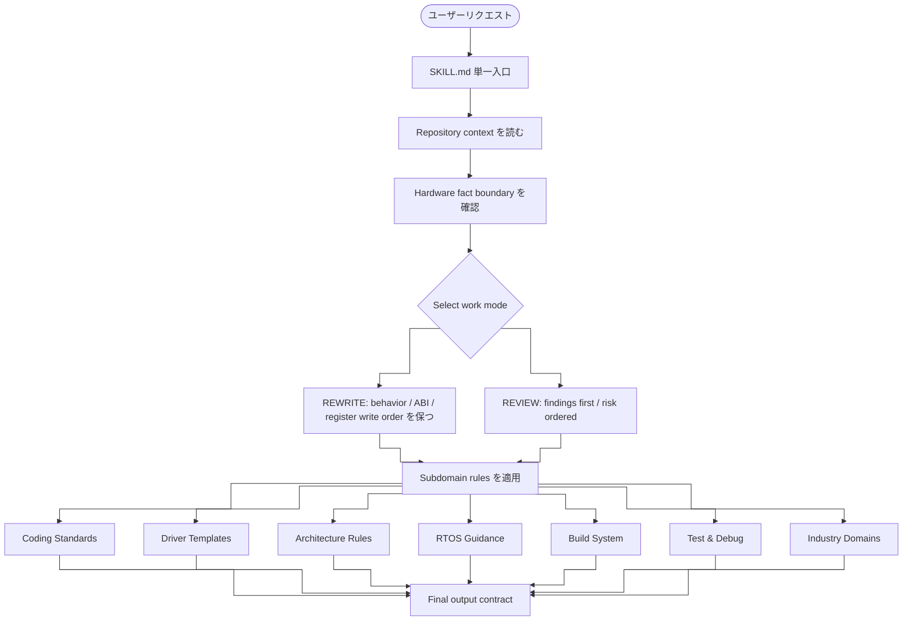

# embedded-code-skill

<p align="center">
  
  
  
  
  
  
  
</p>

> ドライバ骨格の作成、既存コードの整理、低レベルファームウェアのレビュー、RTOS ガイダンス、ビルドシステム設定に使う Embedded C コード助手。

[简体中文](README.md) · [English](README_EN.md) · [日本語](README_JP.md)

---

## このリポジトリについて

このリポジトリのルール入口は `SKILL.md` だけです。

`SKILL.md` は、次の作業でモデルの出力を安定させ、保守的でレビューしやすくします：

- 新しい Embedded C ドライバ骨格を書く（関数レベルテンプレート付き）
- 既存の driver、HAL/BSP、register-access code を整理する
- ISR、DMA、cache、volatile、race、timeout、overflow のリスクをレビューする
- RTOS タスク設計、スレッドセーフ、優先度逆転防止をガイドする
- ビルドシステム設定（CMake クロスコンパイル、リンカスクリプト、スタートアップコード）をガイドする
- HAL 層テストとオンターゲットデバッグ戦略をガイドする
- リポジトリコードが本スキル規則に合致すればそのまま使用し、合致しなければ論理を変えずに規則に統一

これはベンダーのリファレンスマニュアル、実際のレジスタマップ、IRQ、barrier、cache/DMA ルール、タイミング要件、認証資料の代替ではありません。

---

## クイックスタート

```bash
/ecs STM32 UART ドライバを生成、ベースアドレス 0x4000C000
/ecs この SPI 初期化コードを整理し、レジスタ書き込み順序を保つ
/ecs この DMA ISR の race、volatile、cache 問題をレビューする
/ecs FreeRTOS タスク優先度とスタックサイズを設計する
/ecs CMake クロスコンパイル設定とリンカスクリプトを作成する
```

---

## 作業モード

| モード | 用途 |
|--------|------|
| `REWRITE` | public behavior、ABI、register write order、timing-sensitive sequence を保って整理する |
| `REVIEW` | finding を先に出し、correctness、hardware behavior、race、portability risk を優先する |

---

## Skill アーキテクチャ

`SKILL.md` は単一入口です（全 12 章）。構成は、request classification、repository context、work mode、subdomain rules、output contract の順に整理しています。



---

## 機能マトリクス

| 章 | レイヤー | カバー範囲 |
|----|----------|------------|
| Ch.1 | 定位と使用原則 | タスク分類、リポジトリコンテキスト、ハードウェア事実境界、出力契約 |
| Ch.2 | Fallback コーディング規範 | 命名、型、エラー処理、struct パターン、コメント（重複除去済み） |
| Ch.3 | レジスタ抽象化 | 専用レジスタ定義、MASK/SHIFT マクロ、vendor/CMSIS 再利用 |
| Ch.4 | ドライバテンプレート | UART、SPI、I2C、DMA、CAN、GPIO、Timer、Watchdog、MIL-STD-1553（関数レベル骨格付き） |
| Ch.5 | アーキテクチャ規則 | Cortex-M、Cortex-A、ESP32/Xtensa、RP2040、NRF52、RISC-V、PowerPC、SPARC V8 |
| Ch.6 | RTOS ガイダンス | FreeRTOS、Zephyr、RT-Thread：タスク設計、スレッドセーフ、ISR 連携、優先度逆転、デッドロック防止 |
| Ch.7 | ビルドシステム | CMake クロスコンパイル、リンカスクリプト sections、スタートアップコード、コンパイラ属性 |
| Ch.8 | テストとデバッグ | HAL mock パターン、アサーションレベル、オンターゲットデバッグ規約 |
| Ch.9 | 業界ドメイン | 航空、軍事、産業安全、自動車機能安全、general embedded |
| Ch.10 | メモリと並行性 | 動的割り当て制限、VLA 禁止、critical section、memory ordering |
| Ch.11 | アンチパターン | 5つの典型例（レジスタ散在、キャッシュコヒーレンシ、ISR ブロック、volatile 誤用、優先度逆転） |
| Ch.12 | チェックリストとメンテナンス | ハードウェアソース、並行性、RTOS 安全、smoke check シナリオ |

---

## コアルール

| 分類 | ルール |
|------|--------|
| 規則統一 | リポジトリコードが本スキルの規則に合致すればそのまま使用し、合致しなければ論理を変えずに規則に合わせて修正 |
| ハードウェア事実 | register offset、bit field、reset value、IRQ、barrier、timing を捏造しない |
| 出力形式 | rewrite、review それぞれに固定の出力形を使う |
| 型 | public interface では固定幅整数と `bool` を優先する |
| エラー処理 | プロジェクトに規約がない場合のみ `embedded_code_status_t` を使う |
| レジスタアクセス | 専用定義または既存の vendor/CMSIS 構造体を使う |
| メモリ | 低レベルドライバでは動的確保と VLA をデフォルトで避ける |
| 並行性 | ISR、DMA、cache、critical section、memory ordering は保守的に扱う |
| RTOS 安全 | ISR 内でブロック禁止、FromISR API 使用、共有データは同期プリミティブで保護 |

---

## 子領域のカバー範囲

`SKILL.md` には、次の子領域ルールを直接組み込んでいます（全 12 章）。別ディレクトリには分けていません。

### Coding Standards（Ch.2）

- 命名、pointer naming、固定幅型、`bool`
- fallback status type: `embedded_code_status_t`（`VALIDATE_NOT_NULL` と `VALIDATE_INIT` 付き）
- config struct、runtime handle、state enum の構成
- magic number、buffer size、timeout、retry count、コメント、review checklist

### Register Abstraction（Ch.3）

- 周辺ブロックごとに専用 `*_reg.h`
- `*_REG` で統一アクセス、ビットフィールドは `MASK/SHIFT` マクロ
- ビジネスロジックに裸のレジスタアドレスを散在させない

### Driver Templates（Ch.4）

- 共通構成: `*_reg.h`、`*_reg_t`、`*_REG`、`MASK/SHIFT`
- **関数レベル骨格**: UART/SPI/GPIO/DMA の初期化、転送、ISR handler の完全パターン
- UART、SPI、I2C、DMA、CAN、GPIO、Timer、Watchdog、MIL-STD-1553 をカバー
- template は構成例であり、実際の offset、reserved bit、reset value、errata は対象資料に従う

### Architecture Rules（Ch.5）

- ISR、barrier、DMA、cache、interrupt controller、SMP、memory ordering、CSR/SPR をカバー
- Cortex-M、Cortex-A、**ESP32/Xtensa**、**RP2040 デュアルコア**、**NRF52**、RISC-V、PowerPC、SPARC V8 の quick ref を含む
- ESP32 固有パターン: `IRAM_ATTR`、`FromISR` API、デュアルコア負荷分散、高レベル SPI API
- RP2040 固有パターン: Pico SDK、デュアルコア FIFO、DMA チャネル割り当て
- NRF52 固有パターン: nrfx ドライバ層、GPIOTE コールバック、SoftDevice 優先度
- 未知アーキテクチャでは資料を要求し、確認できない場合は architecture-neutral skeleton と placeholder に留める

### RTOS Guidance（Ch.6）

- FreeRTOS、Zephyr、RT-Thread API 比較表
- タスク設計: スタックサイズ、優先度、作成順序、ウォッチドッグ
- スレッドセーフデータ共有: ミューテックス、キュー、アトミック操作
- ISR と RTOS の連携: ブロック禁止、FromISR API 使用、短く高速に
- 優先度逆転防止: 優先度継承ミューテックス
- デッドロック防止: 固定ロック順序、タイムアウト付き待機

### Build System（Ch.7）

- リンカスクリプト: `.text`、`.rodata`、`.data` 再配置、`.bss` ゼロクリア
- スタートアップコード: データコピー、bss クリア、SystemInit、main 呼び出し順序
- コンパイラ属性: `interrupt`、`section`、`aligned`、`weak`、`always_inline`
- CMake クロスコンパイルテンプレート

### Test & Debug（Ch.8）

- HAL mock パターン: 関数ポインタテーブルによる交換可能な HAL
- アサーションレベル: `STATIC_ASSERT`、`ASSERT`、`SOFT_ASSERT`
- オンターゲットデバッグ: デバッグピン、エラーコード追跡、スタックオーバーフロー検出、ウォッチドッグ、ログレベル

### Industry Domains（Ch.9）

- Aerospace / DO-178C、Military / MIL-STD、Industrial / IEC 61508、Automotive / ISO 26262、General Embedded をカバー
- 各ドメインにデフォルト要件（動的割り当て禁止、safe state、インタフェース分離など）があるが、DAL/ASIL/SIL レーティングは汎用デフォルトとして扱わない

---

## パッケージ構成

```text
embedded-code-skill/
├── SKILL.md       # 唯一のルール入口
├── install.sh     # インストールスクリプト
├── LICENSE        # MIT ライセンス
├── README.md      # 中国語 readme
├── README_EN.md   # 英語 readme
└── README_JP.md   # 日本語 readme
```

---

## ライセンス

MIT License
